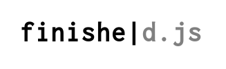

Finishe is a project exploring code completion inside implementation
code, when you already have a unit test.

## Related Research

### Neural Code Completion (2016)
C. Liu, X. Wang, R. Shin, J.E. Gonzalez, D. Song

### Code completion with statistical language models (2014)
Veselin Raychev, Martin Vechev, Eran Yahav

### Learning from examples to improve code completion systems (2009)
Marcel Bruch, Martin Monperrus, Mira Mezini

Compares three code completion methods:

* Eclipse default, showing all the methods on a type. This includes
  the necessary result, but many others too. For SWT's `Text`, it has
  160 methods, but "typically no more than 5 methods are invoked".
  
* Frequency based. Look at the most common methods on each type, and
  sort completion results accordingly.
  
* Association based. Look at associations between the context of the
  variable and the methods later used.
  
* K-Nearest Neighbours.

Their KNN approach performs best in their evaluation, with
association-based a close second.

This paper seems to have culminated in https://www.eclipse.org/recommenders/

## Interesting typescript projects

Canidates for generating statistical models.

[typescript-eslint](https://github.com/typescript-eslint/typescript-eslint), such as [its many
rules](https://github.com/typescript-eslint/typescript-eslint/tree/master/packages/eslint-plugin/src/rules).

[apollo-client](https://github.com/apollographql/apollo-client).

[vscode](https://github.com/microsoft/vscode).

[xterm.js](https://github.com/xtermjs/xterm.js).
